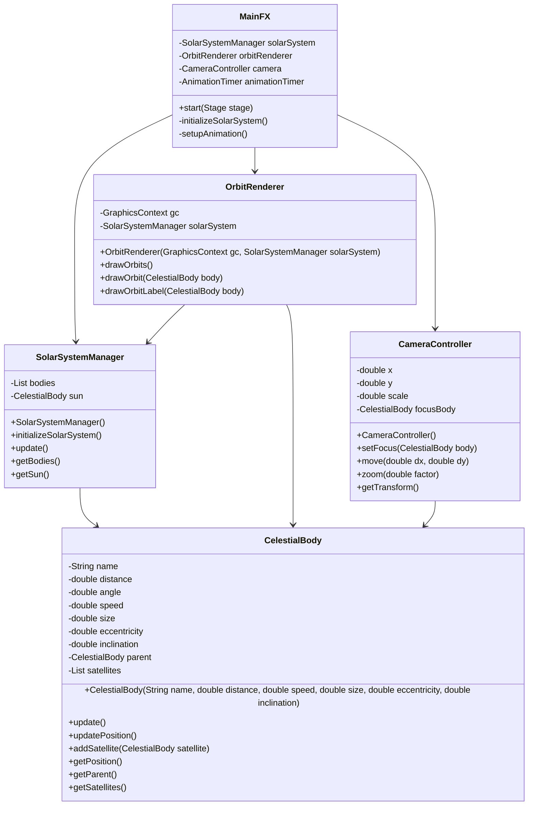

# クラス図

## 概要
JavaFX版太陽系シミュレーターのクラス構造を示す図です。

## クラス構造



## 主要なクラスの説明

### MainFX
- アプリケーションのエントリーポイント
- JavaFXの初期化とメインループの管理
- 各コンポーネントの初期化と連携

### SolarSystemManager
- 太陽系全体の管理
- 天体の初期化と更新
- 天体間の階層関係の管理

### CelestialBody
- 天体の基本情報と状態の管理
- 軌道計算と位置更新
- 衛星の管理

### OrbitRenderer
- 軌道の描画
- ラベルの描画
- デバッグ情報の表示

### CameraController
- カメラの位置とスケールの管理
- フォーカス対象の管理
- 座標変換の提供

## 軌道計算の最適化

### 位置計算の改善
```java
private void updatePosition() {
    // 基本位置の計算
    double baseX = distance * Math.cos(angle);
    double baseY = distance * Math.sin(angle);

    // 軌道傾斜の適用
    double rotatedX = baseX * Math.cos(inclination) - baseY * Math.sin(inclination);
    double rotatedY = baseX * Math.sin(inclination) + baseY * Math.cos(inclination);

    // 親天体からの相対位置
    if (parent != null) {
        Point2D parentPos = parent.getPosition();
        x = parentPos.getX() + rotatedX;
        y = parentPos.getY() + rotatedY;
    } else {
        x = rotatedX;
        y = rotatedY;
    }
}
```

### 数値安定性の確保
- 極端な離心率への対応
- 軌道傾斜の適切な処理
- 親天体との相対位置の正確な計算 